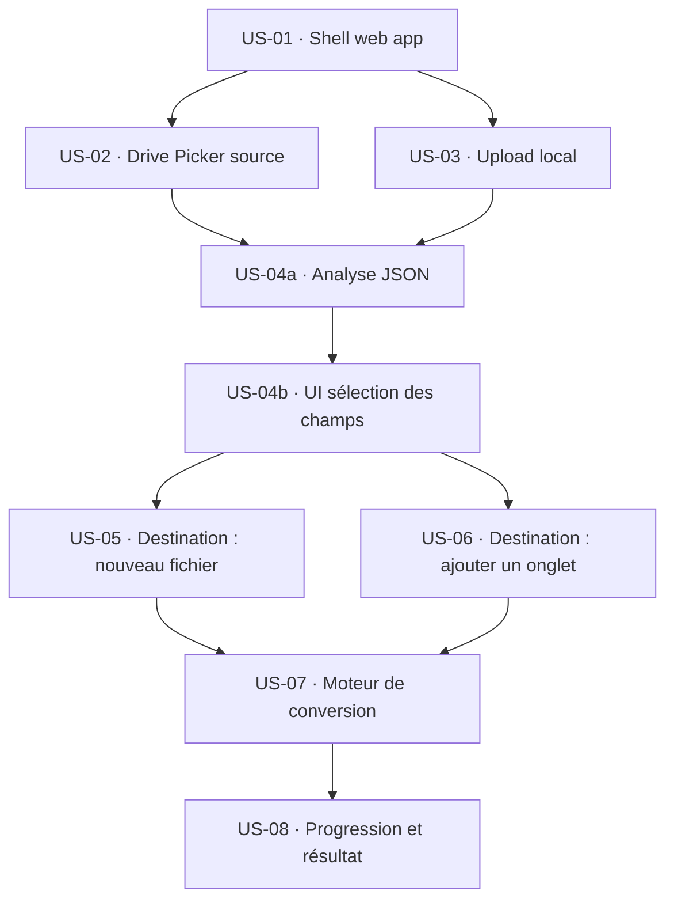

# BACKLOG_v3.md — JSON_2_Sheets v3

Epic : remplacer l'entrée "script dans un Sheets" par une page web autonome, accessible à toute l'organisation Google Workspace, utilisable sans compétence technique.

---

## Graphe de dépendances

---

## Première passe — US identifiées

| ID | Titre court | Taille initiale | Décision |
|---|---|---|---|
| US-01 | Shell web app | M | ✅ Conservée |
| US-02 | Drive Picker source JSON | M | ✅ Conservée |
| US-03 | Upload local source JSON | S | ✅ Conservée |
| US-04 | Analyse JSON + sélection des champs | **L** | ✂️ Découpée en US-04a + US-04b |
| US-05 | Destination : nouveau fichier | M | ✅ Conservée |
| US-06 | Destination : ajouter un onglet | M | ✅ Conservée |
| US-07 | Moteur de conversion | M | ✅ Conservée |
| US-08 | Progression et résultat | S | ✅ Conservée |

---

## Backlog final (toutes les US sont S ou M)

---

### US-01 — Shell web app

> En tant qu'utilisateur de l'organisation,
> je veux accéder à une page web via une URL partagée,
> afin de lancer le processus de conversion sans ouvrir aucun fichier au préalable.

**Taille :** M
**Dépend de :** aucune (US fondatrice)

**Critères d'acceptance :**
- La page est accessible depuis n'importe quel compte Google de l'organisation
- Elle affiche les 3 étapes du wizard (Source / Champs / Destination) avec l'étape 1 active et les suivantes verrouillées
- Un utilisateur hors organisation reçoit un refus d'accès explicite

---

### US-02 — Source : Drive Search

> En tant qu'utilisateur,
> je veux pouvoir rechercher un fichier JSON depuis mon Google Drive en tapant son nom,
> afin de le sélectionner sans avoir à chercher et copier-coller une URL technique.

**Taille :** M
**Dépend de :** US-01

**Critères d'acceptance :**
- Un clic sur le bouton ouvre le Drive Picker Google (fenêtre de navigation Drive standard)
- Seuls les fichiers `.json` sont sélectionnables dans le picker
- Une fois le fichier sélectionné, son nom s'affiche comme confirmation et l'étape 1 se marque comme complétée

---

### US-03 — Source : Upload local

> En tant qu'utilisateur,
> je veux pouvoir charger un fichier JSON depuis mon ordinateur,
> afin de traiter des fichiers qui ne sont pas encore sur mon Drive.

**Taille :** S
**Dépend de :** US-01

**Critères d'acceptance :**
- Un bouton "Depuis mon ordinateur" ouvre l'explorateur de fichiers du système
- Seuls les fichiers `.json` sont acceptés ; tout autre type déclenche un message d'erreur clair (non technique)
- Une fois le fichier chargé, son nom s'affiche et l'étape 1 se marque comme complétée

---

### US-04a — Analyse JSON

> En tant qu'utilisateur,
> je veux que le système lise automatiquement mon fichier JSON après sa sélection,
> afin que je n'aie pas à comprendre sa structure moi-même.

**Taille :** S
**Dépend de :** US-02 OU US-03

**Critères d'acceptance :**
- Dès que la source est fournie (Drive ou local), l'analyse se déclenche sans action supplémentaire de l'utilisateur
- Le système extrait toutes les branches de premier niveau du JSON (ex. si le JSON contient `nom`, `adresse`, `commandes`, ces 3 branches sont identifiées)
- Si le JSON est vide ou invalide, un message d'erreur non technique s'affiche ("Ce fichier ne semble pas être un JSON valide")

---

### US-04b — UI sélection des champs

> En tant qu'utilisateur,
> je veux voir la liste des champs disponibles dans mon JSON et pouvoir choisir ceux à conserver,
> afin de contrôler quelles colonnes apparaîtront dans mon tableau final.

**Taille :** S
**Dépend de :** US-04a

**Critères d'acceptance :**
- Tous les champs sont cochés par défaut (logique "friction-less")
- L'utilisateur peut décocher un ou plusieurs champs
- Un indicateur résume la sélection (ex. "8 champs sur 10 sélectionnés")
- Il est impossible de passer à l'étape suivante sans qu'au moins un champ soit coché

---

### US-05 — Destination : nouveau fichier Sheets

> En tant qu'utilisateur,
> je veux créer un nouveau fichier Google Sheets qui recevra mes données,
> afin d'obtenir un tableau propre sans modifier aucun fichier existant.

**Taille :** M
**Dépend de :** US-04b

**Critères d'acceptance :**
- L'utilisateur peut saisir un nom pour le fichier (champ pré-rempli avec un nom par défaut)
- Le fichier est créé dans "Mon Drive" sans action supplémentaire
- Le mode "Nouveau fichier" est l'option sélectionnée par défaut dans l'étape 3

---

### US-06 — Destination : ajouter un onglet à un fichier existant

> En tant qu'utilisateur,
> je veux ajouter les données extraites comme un nouvel onglet dans un fichier Sheets existant,
> afin de conserver plusieurs extractions dans un même fichier sous forme d'historique.

**Taille :** M
**Dépend de :** US-04b

**Critères d'acceptance :**
- L'utilisateur peut sélectionner un fichier Sheets existant via le Drive Picker (filtré sur les Sheets uniquement)
- Un nom d'onglet est proposé automatiquement avec la date et l'heure (ex. `Export_2026-05-22_14h30`)
- L'utilisateur peut modifier ce nom avant de lancer la conversion

---

### US-07 — Moteur de conversion

> En tant qu'utilisateur,
> je veux que mes données JSON soient écrites dans le fichier cible avec les champs sélectionnés en colonnes,
> afin d'obtenir un tableau lisible et exploitable.

**Taille :** M
**Dépend de :** US-05 ET/OU US-06

**Critères d'acceptance :**
- La première ligne du tableau contient les noms des champs sélectionnés (en-têtes)
- Chaque entrée du JSON devient une ligne du tableau
- Les valeurs imbriquées dans une branche sélectionnée sont aplaties en une seule cellule (texte)
- Le moteur réutilise la logique d'écriture par lots de la v2 pour supporter les grands fichiers sans timeout

---

### US-08 — Progression et résultat

> En tant qu'utilisateur,
> je veux voir l'avancement de la conversion et accéder directement au fichier créé,
> afin de savoir que tout s'est bien passé et de commencer à utiliser mon tableau immédiatement.

**Taille :** S
**Dépend de :** US-07

**Critères d'acceptance :**
- Une barre de progression ou un indicateur animé s'affiche pendant la conversion
- En cas d'erreur, un message non technique décrit le problème et suggère une action (ex. "Le fichier n'a pas pu être créé — vérifiez vos droits Drive")
- En cas de succès, un bouton "Ouvrir le fichier" apparaît et pointe directement vers le Sheets créé ou modifié

---

## Scope reporté à v3.x

| Fonctionnalité | Condition de déclenchement |
|---|---|
| Mode "Remplacer les données" d'un onglet existant | Si demande utilisateur avérée |
| Source JSON depuis une URL externe / API | Si demande utilisateur avérée |
| Sélection des sous-champs (profondeur > niveau 1) | Évolution naturelle après stabilisation v3 |
| Drive Picker natif (navigation visuelle dans l'arborescence) pour US-02 | Requiert clé API GCP — évolution de US-02 quand setup GCP accepté |
